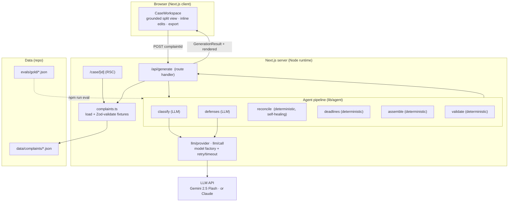
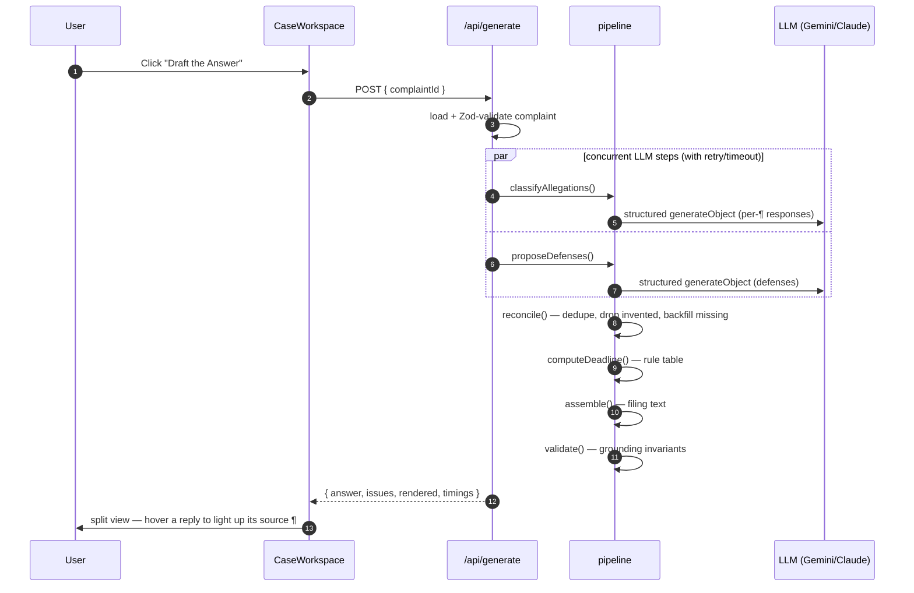
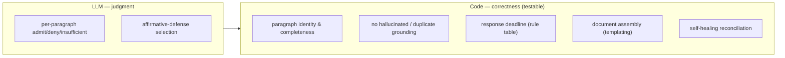
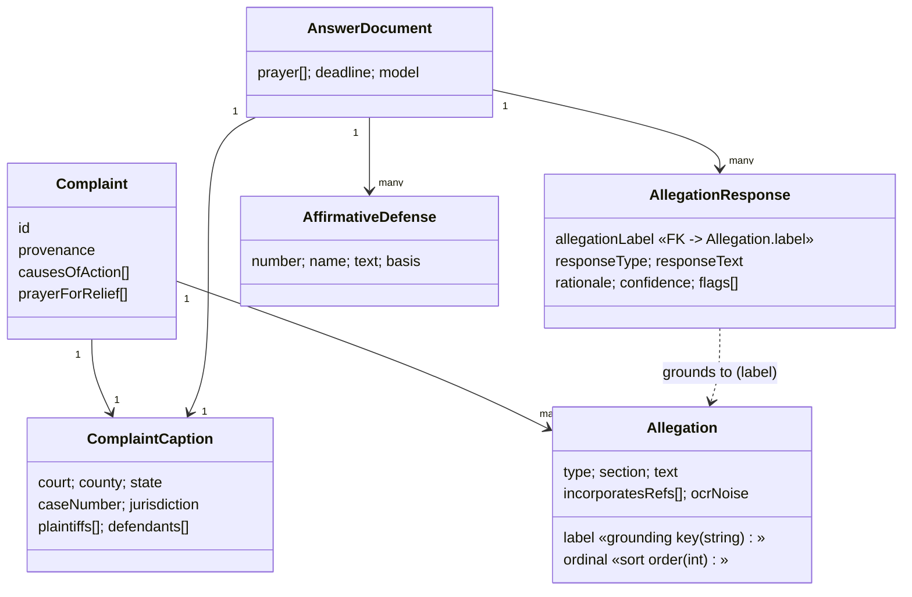
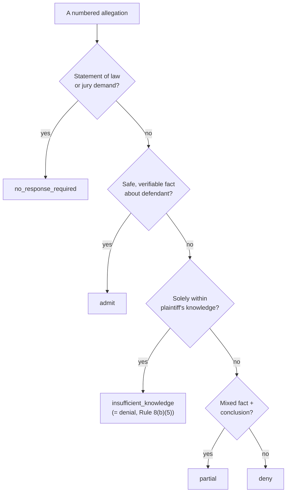

# System Design — Answerlight

*Draft the Answer. Trust it in minutes.*

This document covers the architecture, data model, control flow, and the design
decisions behind them. For the product rationale (why this workflow), see the
[README](../README.md).

---

## 1. Design goals

| Goal | How it shows up in the system |
|---|---|
| **Trustworthy output** | Grounding is enforced in code; the model can't emit an incomplete or invented Answer |
| **Auditable, not magic** | Every response links to a source paragraph; every step is timed and surfaced |
| **Robust on flaky free-tier infra** | Retries + timeouts on LLM calls; deterministic self-healing of model output |
| **Provider-portable** | One factory swaps Gemini ↔ Claude with no agent-code changes |
| **Generalizes across real filings** | String paragraph labels, per-jurisdiction deadlines, OCR-noise handling |

The throughline: **the LLM is used only for judgment; everything where "correct"
is well-defined is deterministic.**

---

## 2. Component view

---

## 3. Request flow (drafting an Answer)

Concurrency: `classify` and `defenses` are independent and run with
`Promise.all`. Both are wrapped in `withRetry` (exponential backoff + 45s abort).

---

## 4. The trust boundary — who owns "correct"

A dropped paragraph, an invented one, or a wrong deadline are *substantive*
defects in a legal filing — so none of those are left to the model. The
[reconcile](../lib/agent/reconcile.ts) step guarantees the output always has
exactly one grounded response per allegation, repairing model mistakes and
flagging the repairs; [validate](../lib/agent/validate.ts) then asserts the
invariant. The same validators back the eval harness.

**Backfill safety rule:** a synthesized response is *never* an admission —
admitting is the only move that can concede liability, so backfills are always a
denial-equivalent, low-confidence, and flagged for attorney review.

---

## 5. Data model

Key decisions:

- **`label` is a string, not a number.** Real complaints number paragraphs
  inconsistently — `1`, `1.1`, `2.16`, sometimes `FIRST`. The grounding key is
  whatever the filing used; a separate integer `ordinal` owns sort order so
  display never depends on parsing `"2.16"` as a number.
- **`responseText` (filed) is separate from `rationale` (why).** The rationale is
  reviewer-facing and never appears in the document.
- **`provenance` is part of the model**, so "this is real public data" is
  auditable rather than asserted.
- Everything is a **Zod schema** — fixtures are validated on read, model output is
  parsed into the same types, and the eval cross-checks gold against the schema.

---

## 6. Response taxonomy (FRCP 8(b))

This is the heuristic encoded in the [classify](../lib/agent/classify.ts) system
prompt and the hand-labeled [gold standard](../evals/gold).

---

## 7. Evaluation

`npm run eval` runs the real pipeline against hand-labeled gold and scores:

- **Classification accuracy** — response ∈ the *acceptable set* for each paragraph
  (legal drafting has more than one defensible answer, so gold encodes a primary
  plus acceptable alternatives).
- **Grounding errors** — reusing the production validators (completeness,
  hallucination, duplicates).

Pass bar: ≥85% accuracy and zero grounding errors per case. Current: **~94%
overall, 0 grounding errors** across the three sample cases.

`npm test` (Vitest) covers the deterministic core in isolation: grounding
invariants, deadline rules, self-healing reconciliation (incl. the never-admit
safety rule), document assembly determinism, the retry wrapper, and
fixture/gold integrity.

---

## 8. Failure modes & handling

| Failure | Handling |
|---|---|
| LLM timeout / rate-limit | `withRetry`: 3 attempts, exponential backoff, 45s abort |
| Model omits a paragraph | `reconcile` backfills a conservative default, flags it |
| Model invents a paragraph | `reconcile` drops it, flags it |
| Model duplicates a paragraph | `reconcile` keeps first, drops rest |
| Model returns low confidence | surfaced as a review warning in the UI |
| Missing API key | API returns a clear 400 with a link to a free key |
| Unknown jurisdiction deadline | conservative default + explicit "VERIFY" flag |
| Malformed fixture | Zod throws on load — fails loud, not silent |

---

## 9. What would change for production

- Persist drafts + a full edit/audit trail (who changed which response, when).
- `.docx` export with firm caption templates; e-filing integration.
- A second-pass "critic" model that flags any response readable as an admission
  of liability before a human sees it.
- Expand the eval set across claim types; wire accuracy as a CI regression gate.
- Live complaint ingestion (PACER/RECAP) with a human-in-the-loop segmentation
  review for arbitrary uploads.
